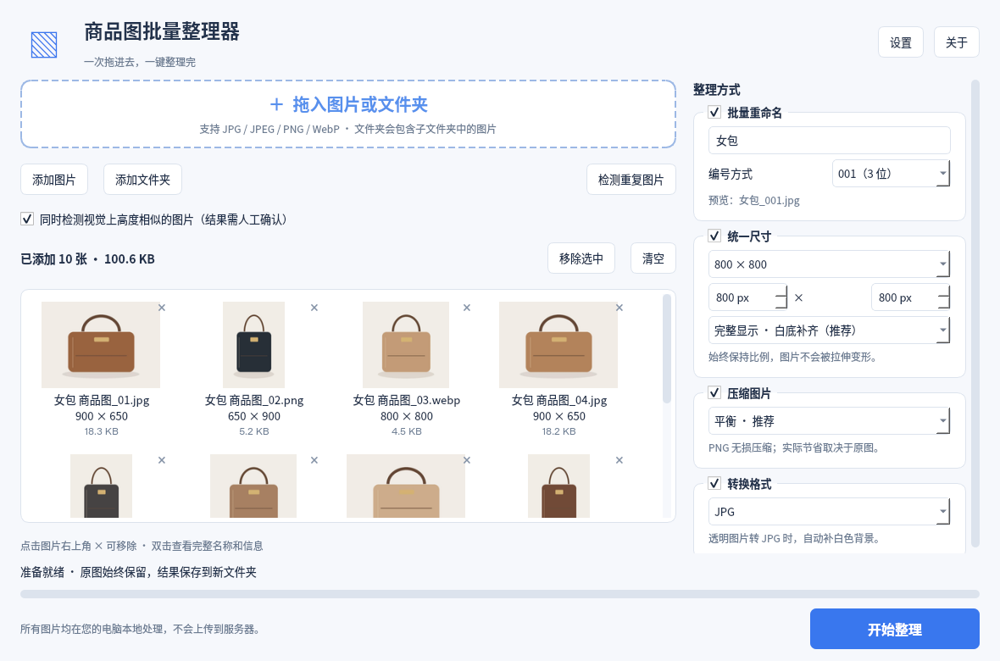

# 商品图批量整理器

面向小商家的 Windows 本地桌面软件。拖入商品图片，设置改名、尺寸、压缩和格式，一键输出到新文件夹。无需登录、无需服务器、无需 AI、无需联网处理图片。

**原图始终只读：不修改、不覆盖、不删除。**



## 普通用户怎么使用

下载 `ProductImageOrganizer-1.0.0-Setup.exe`，双击安装，再打开桌面快捷方式。无需安装 Python 或其他开发环境。

1. 拖入图片或文件夹，也可以点击「添加图片」「添加文件夹」。
2. 根据需要勾选右侧功能。默认仅启用平衡压缩，保持原始尺寸和格式。
3. 可点击「检测重复图片」，确认哪些图片需要输出。
4. 点击「开始整理」，选择保存位置。
5. 软件创建 `商品图整理完成_日期_时间` 新文件夹。处理后点击「打开输出文件夹」。

图片列表右上角的 × 只移除列表条目。相似检测结果取消勾选只影响输出。软件从不删除原图。

## 已实现

- JPG / JPEG / PNG / WebP 图片及文件夹拖放，递归导入，缩略图、尺寸、大小和中文文件名。
- 批量重命名，3 位 / 4 位编号，数量超过编号位数时自动继续增长。
- 800、1080、1200 方形快捷尺寸，以及自定义宽高；按比例白底补齐或居中裁切。
- 高质量 / 平衡 / 更小体积压缩。PNG 无损；JPG / WebP 使用对应质量参数。
- JPG / PNG / WebP 转换；PNG 转 JPG 透明区域补白；保留原格式。
- SHA-256 完全重复检测，以及基于图像结构、颜色和比例的疑似相似检测。
- 重复筛选、每组保留一张及二次确认，只影响最终输出。
- 后台读取、检测和处理，实时进度、取消、成功 / 失败统计、大小比较和本地 JSON 整理报告。
- 输出同名自动加编号，原图保护；损坏、权限和磁盘空间错误使用中文提示。
- 默认格式、尺寸、压缩质量，记住设置，浅色 / 深色 / 跟随系统。
- 识别 EXIF 方向；有效 ICC 色彩描述转换到 sRGB；无效色彩描述不会阻止处理。

## 怎么生成 Windows 安装包

仓库：<https://github.com/lear19910209-collab/codex>。

**最简单的方式：使用 GitHub Actions，不需要在电脑上配置开发环境。**

1. 打开仓库，点击上方 **Actions**。
2. 左侧选择 **Windows 商品图批量整理器**。
3. 点击 **Run workflow**，保持默认分支，再点击绿色按钮。
4. 等待运行显示绿色勾。点进这一次运行页面。
5. 在页面下方 **Artifacts** 下载 **Windows-商品图批量整理器-1.0.0**。
6. 解压下载文件，找到 `ProductImageOrganizer-1.0.0-Setup.exe`。

源码发生变化时也会自动测试和生成安装包。构建会先执行图片与界面测试，再打包 exe、生成中文安装包，并检查便携版和安装后的程序能否启动、正常关闭。失败时不会发布安装包。

Artifacts 默认保存 90 天；请把安装包下载到自己电脑保存。构建下载依赖需要联网；生成的软件不需要联网。

如果只有本地源码压缩包：解压后将顶层 `.github`、`product-image-organizer` 和 `README.md` 上传到 GitHub 仓库根目录即可。`.github/workflows` 必须位于仓库根目录，不能再多包一层目录。这里已提供配置文件，无需修改代码。

### 打包文件在哪里

GitHub 构建产物里包含：

- `ProductImageOrganizer-1.0.0-Setup.exe`：**给普通买家发这个文件即可**。
- `ProductImageOrganizer-1.0.0-Portable.zip`：免安装版。买家必须完整解压后双击其中的 `商品图批量整理器.exe`。
- `SHA256SUMS.txt`：文件校验值。
- `test-results.xml`：自动测试结果。

本地 Windows 构建输出到本项目 `release/`；目录式程序在 `dist/商品图批量整理器/`。不要只拿目录式程序中的 exe 发给买家，它需要同目录 `_internal` 文件夹。

## 依赖与商业分发

Python 3.12、PySide6-Essentials / Qt 6.8.3、Pillow 11.3.0、PyInstaller 6.16.0、Inno Setup 6.x；测试使用 pytest 8.4.2。详见 [开源依赖说明](docs/THIRD_PARTY.md)。

项目代码采用 MIT 许可，可商业销售。随包提供 LGPLv3 依赖许可、版权声明和对应 Qt / PySide 源码。保留完整安装包和这些文件，销售条款不能限制用户对 LGPL 库的替换和必要调试权利。

## 以后修改，主要文件在哪里

| 文件 | 作用 |
| --- | --- |
| `main.py` | 软件启动和图标 |
| `organizer/ui.py` | 中文界面、进度、重复筛选和结果窗口 |
| `organizer/core.py` | 图片处理、原图保护、重复检测、报告 |
| `organizer/settings.py` | 本地设置保存 |
| `tests/` | 图片和界面自动测试 |
| `scripts/build.py` | 打包 exe 和便携版 |
| `scripts/fetch_open_source.py` | 准备随包提供的开源源码及许可 |
| `packaging/installer.iss` | Windows 中文安装程序 |
| 仓库根目录 `.github/workflows/product-image-windows.yml` | GitHub 一键构建 |

设置只保存在用户电脑 `%APPDATA%/LocalImageTools/ProductImageOrganizer/preferences.json`（具体位置由 Qt 系统目录确定）。不记住图片列表；没有遥测、更新检查和联网调用。关闭「记住上一次设置」会清除保存的上一套整理参数和输出位置，默认偏好与主题仍保留。

## 测试与当前限制

查看 [测试与交付说明](docs/TEST_REPORT.md)。截图由真实 Qt 窗口生成，商品缩略图使用本地绘制的测试样本。

- Windows 10 / 11 64 位；不提供 32 位和 Windows 7 版本。
- 相似检测属于启发式判断，可能漏报或误报，必须人工确认。裁切、旋转、大幅调色通常不会识别为同一图。
- 单张最多 8000 万像素；动态 WebP / APNG、多页图暂不支持。取消在当前图片完成后生效。
- PNG 是无损压缩，可能节省很少；转换格式或增大尺寸可能增大体积，会如实显示增加值。
- 第一版没有代码签名证书，Windows 可能提示「未知发布者」。售卖前建议发布者购买证书并签名，证书不是软件运行必需品。
- 自动化构建和启动检查不能代替在真实买家电脑上的最终验收；销售前在一台 Windows 10 和一台 Windows 11 电脑上按 [验收清单](docs/WINDOWS_ACCEPTANCE.md) 走一遍。

## 给维护者的本地运行方式

普通用户不需要执行以下命令。维护者可在 Python 3.12 环境中运行：

```bash
python -m pip install -r requirements-dev.txt
python main.py
python -m pytest
```

维护者在 Windows 本地打包：

```powershell
python scripts/fetch_open_source.py
python scripts/build.py
& 'C:\Program Files (x86)\Inno Setup 6\ISCC.exe' packaging/installer.iss
```

GitHub 工作流已负责安装 Inno Setup 和简体中文语言文件，普通使用者不必做这些操作。
